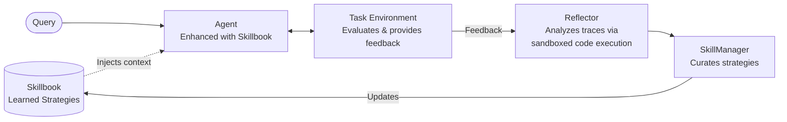

# Agentic Context Engine (ACE)


[](https://discord.gg/mqCqH7sTyK)
[](https://twitter.com/kaybaai)
[](https://badge.fury.io/py/ace-framework)
[](https://www.python.org/downloads/) 

[](https://kayba-ai.github.io/agentic-context-engine/latest/)

**AI agents that get smarter with every task**

⭐ Star this repo if you find it useful!

> **🚀 ACE v2 is coming.** We're rebuilding the framework from the ground up — a cleaner architecture, a modular pipeline engine, first-class async support, and a dramatically simpler API. Everything you love about ACE, refined and supercharged. Follow the progress in [`ace_next/`](ace_next/) and [`pipeline/`](pipeline/), or join the [Discord](https://discord.gg/mqCqH7sTyK) to stay in the loop.

---

## What is ACE?

ACE enables AI agents to **learn from their execution feedback**—what works, what doesn't—and continuously improve. No fine-tuning, no training data, just automatic in-context learning.

The framework maintains a **Skillbook**: a living document of strategies that evolves with each task. When your agent succeeds, ACE extracts patterns. When it fails, ACE learns what to avoid. All learning happens transparently in context.

- **Self-Improving**: Agents autonomously get smarter with each task
- **20-35% Better Performance**: Proven improvements on complex tasks
- **49% Token Reduction**: Demonstrated in browser automation benchmarks
- **No Context Collapse**: Preserves valuable knowledge over time

---

## LLM Quickstart
1. Direct your favorite coding agent (Cursor, Claude Code, Codex, etc) to [Quick Start Guide](docs/QUICK_START.md)
2. Prompt away!

---

## Quick Start

### 1. Install

```bash
pip install ace-framework
```

### 2. Set API Key

```bash
export OPENAI_API_KEY="your-api-key"
```

### 3. Run

```python
from ace import ACELiteLLM

agent = ACELiteLLM(model="gpt-4o-mini")

answer = agent.ask("What does Kayba's ACE framework do?")
print(answer)  # "ACE allows AI agents to remember and learn from experience!"
```

**Done! Your agent learns automatically from each interaction.**

[→ Quick Start Guide](docs/QUICK_START.md) | [→ Setup Guide](docs/SETUP_GUIDE.md)

---

## Use Cases

### Claude Code with Learning [→ Quick Start](ace/integrations/claude_code)
Run coding tasks with Claude Code while ACE learns patterns from each execution, building expertise over time for your specific codebase and workflows.

### Automated System Prompting
The Skillbook acts as an evolving system prompt that automatically improves based on execution feedback—no manual prompt engineering required.

### Enhance Existing Agents
Wrap your existing agent (browser-use, LangChain, custom) with ACE learning. Your agent executes tasks normally while ACE analyzes results and builds a skillbook of effective strategies.

### Build Self-Improving Agents
Create new agents with built-in learning for customer support, data extraction, code generation, research, content creation, and task automation.

---

## Demos

### The Seahorse Emoji Challenge

A challenge where LLMs often hallucinate that a seahorse emoji exists (it doesn't).


In this example:
1. The agent incorrectly outputs a horse emoji
2. ACE reflects on the mistake without external feedback
3. On the second attempt, the agent correctly realizes there is no seahorse emoji

[→ Try it yourself](examples/litellm/seahorse_emoji_ace.py)

### Tau2 Benchmark

Evaluated on the airline domain of [τ2-bench](https://github.com/sierra-research/tau2-bench) (Sierra Research) — a benchmark for multi-step agentic tasks requiring tool use and policy adherence. Agent: Claude Haiku 4.5. Strategies learned on the train split with no reward signals; all results on the held-out test split.

*pass^k = probability that all k independent attempts succeed. Higher k is a stricter test of agent consistency.*


ACE doubles agent consistency at pass^4 using only 15 learned strategies — gains compound as the bar gets higher.

### Browser Automation

**Online Shopping Demo**: ACE vs baseline agent shopping for 5 grocery items.


In this example:
- ACE learns to navigate the website over 10 attempts
- Performance stabilizes and step count decreases by 29.8%
- Token costs reduce 49.0% for base agent and 42.6% including ACE overhead

[→ Try it yourself & see all demos](examples/browser-use/README.md)

### Claude Code Loop

In this example, Claude Code is enhanced with ACE and self-reflects after each execution while translating the ACE library from Python to TypeScript.

**Python → TypeScript Translation:**

| Metric | Result |
|--------|--------|
| Duration | ~4 hours |
| Commits | 119 |
| Lines written | ~14k |
| Outcome | Zero build errors, all tests passing |
| API cost | ~$1.5 (Sonnet for learning) |

[→ Claude Code Loop](examples/claude-code-loop/)

---

## Integrations

ACE integrates with popular agent frameworks:

| Integration | ACE Class | Use Case |
|-------------|-----------|----------|
| LiteLLM | `ACELiteLLM` | Simple self-improving agent |
| LangChain | `ACELangChain` | Wrap LangChain chains/agents |
| browser-use | `ACEAgent` | Browser automation |
| Claude Code | `ACEClaudeCode` | Claude Code CLI |
| ace-learn CLI | `ACEClaudeCode` | Learn from Claude Code sessions |
| Opik | `OpikIntegration` | Production monitoring and cost tracking |

[→ Integration Guide](docs/INTEGRATION_GUIDE.md) | [→ Examples](examples/)

---

## How Does ACE Work?

*Inspired by the [ACE research framework](https://arxiv.org/abs/2510.04618) from Stanford & SambaNova.*

ACE enables agents to learn from execution feedback — what works, what doesn't — and continuously improve. No fine-tuning, no training data, just automatic in-context learning. Three specialized roles work together:

1. **Agent** — Your agent, enhanced with strategies from the Skillbook
2. **Reflector** — Analyzes execution traces to extract learnings. In recursive mode, the Reflector writes and runs Python code in a sandboxed REPL to programmatically query traces — finding patterns, errors, and insights that single-pass analysis misses
3. **SkillManager** — Curates the Skillbook: adds new strategies, refines existing ones, and removes outdated patterns based on the Reflector's analysis

The key innovation is the **Recursive Reflector** — instead of summarizing traces in a single pass, it writes and executes Python code in a sandboxed environment to programmatically explore agent execution traces. It can search for patterns, isolate errors, query sub-agents for deeper analysis, and iterate until it finds actionable insights. These insights flow into the **Skillbook** — a living collection of strategies that evolves with every task.



---

## Documentation

- [Kayba Documentation](https://kayba-ai.github.io/agentic-context-engine/latest/) - Full documentation with guides, API reference, and examples

Quick links:
- [Quick Start Guide](https://kayba-ai.github.io/agentic-context-engine/latest/getting-started/quickstart/) - Get running in 5 minutes
- [Setup Guide](https://kayba-ai.github.io/agentic-context-engine/latest/getting-started/setup/) - Installation, configuration, providers
- [Integration Guide](https://kayba-ai.github.io/agentic-context-engine/latest/integrations/browser-use/) - Add ACE to existing agents
- [API Reference](https://kayba-ai.github.io/agentic-context-engine/latest/api/) - Complete API documentation
- [Examples](examples/) - Ready-to-run code examples
- [Changelog](CHANGELOG.md) - Recent changes

---

## Contributing

We love contributions! Check out our [Contributing Guide](CONTRIBUTING.md) to get started.

---

## Acknowledgment

Inspired by the [ACE paper](https://arxiv.org/abs/2510.04618) and [Dynamic Cheatsheet](https://arxiv.org/abs/2504.07952).

---

<div align="center">

**⭐ Star this repo if you find it useful!**

**Built with ❤️ by [Kayba](https://kayba.ai) and the open-source community.**

</div>
