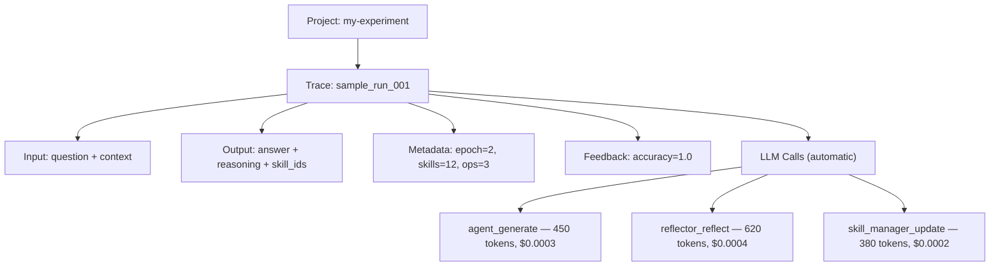

# Opik Observability

ACE integrates with [Opik](https://github.com/comet-ml/opik) for tracing, cost tracking, and performance monitoring. All Opik tracing is **explicit opt-in** — it is never auto-enabled just because the package is installed.

Two independent tracing modes:

1. **Pipeline step** (`OpikStep`) — client-agnostic, logs one Opik trace per sample with ACE context fields.
2. **LiteLLM callback** (`register_opik_litellm_callback`) — LiteLLM-specific, tracks per-LLM-call tokens and costs.

## Installation

```bash
pip install ace-framework[observability]
```

## Quick Start

```python
from ace_next import ACELiteLLM

# Easiest: ACELiteLLM enables both tracing modes with one flag
ace = ACELiteLLM.from_model("gpt-4o-mini", opik=True, opik_project="my-experiment")
```

```python
from ace_next import (
    ACE, OpikStep,
    Agent, Reflector, SkillManager,
    LiteLLMClient, SimpleEnvironment,
)

# Manual: Add OpikStep via extra_steps
client = LiteLLMClient(model="gpt-4o-mini")

runner = ACE.from_roles(
    agent=Agent(client),
    reflector=Reflector(client),
    skill_manager=SkillManager(client),
    environment=SimpleEnvironment(),
    extra_steps=[OpikStep(project_name="my-experiment")],
)
```

```python
# LLM-level cost tracking only (no pipeline traces)
from ace_next import register_opik_litellm_callback

registered = register_opik_litellm_callback(project_name="my-experiment")
```

## Starting the Opik Server

=== "Local (Docker)"

    ```bash
    docker run -d -p 5173:5173 --name opik ghcr.io/comet-ml/opik:latest

    # View traces at http://localhost:5173
    ```

=== "Comet Cloud"

    ```bash
    export COMET_API_KEY="your-api-key"
    # Traces appear at https://www.comet.com/opik
    ```

## OpikStep

`OpikStep` is a terminal side-effect step that logs one Opik trace per sample. It reads context fields but never mutates them — safe to append to any pipeline.

### Parameters

| Parameter | Type | Default | Description |
|-----------|------|---------|-------------|
| `project_name` | `str` | `"ace-framework"` | Opik project for organizing traces |
| `tags` | `list[str]` | `None` | Extra tags attached to every trace |

### What Gets Logged

Each trace includes:

| Field | Source |
|-------|--------|
| **Input** | Question and context from the sample |
| **Output** | Answer, reasoning, and skill IDs from `AgentOutput` |
| **Metadata** | Epoch, step index, skill count, reflection insights, operation counts |
| **Feedback scores** | Accuracy extracted from environment feedback (correct / incorrect) |

### Trace Hierarchy



## LLM Cost Tracking

`OpikStep` does **not** register the LiteLLM callback — the two tracing modes are independent. To get per-LLM-call cost tracking, call `register_opik_litellm_callback()` separately:

```python
from ace_next import register_opik_litellm_callback

success = register_opik_litellm_callback(project_name="cost-tracking")
# Returns True if registered, False if Opik unavailable
```

Every LLM call is then automatically tracked with:

- Input / output tokens
- Model used
- Cost per call
- Latency

When using `ACELiteLLM` with `opik=True`, both modes are enabled together automatically — no need to call `register_opik_litellm_callback()` manually.

## Environment Variables

| Variable | Description | Default |
|----------|-------------|---------|
| `OPIK_PROJECT_NAME` | Project name for organizing traces | `ace-framework` |
| `OPIK_DISABLED=true` | Disable all Opik tracing | Not set |
| `OPIK_ENABLED=false` | Alternative way to disable tracing | Not set |
| `OPIK_URL_OVERRIDE` | Custom Opik server URL | `http://localhost:5173/api` |
| `OPIK_WORKSPACE` | Opik workspace name | `default` |

## Error Handling

When using `ACELiteLLM` with `opik=True`, errors are **raised immediately**:

- `ImportError` if the `opik` package is not installed
- `RuntimeError` if the Opik client fails to initialize (bad config, disabled via env vars)

This ensures you know immediately if tracing is broken, rather than discovering missing traces later.

When using `OpikStep` directly via `extra_steps`, it soft-imports Opik and silently becomes a no-op if the package is absent — useful for pipelines that should work with or without observability.

```python
from ace_next import OPIK_AVAILABLE

if OPIK_AVAILABLE:
    print("Opik tracing is available")
```

## Troubleshooting: `~/.opik.config`

The Opik SDK stores a global config file at `~/.opik.config` (created by `opik.configure()`). This file **overrides environment variables** and can cause silent failures if it contains stale settings.

If traces aren't appearing, check:

```bash
cat ~/.opik.config
```

A correct config for Comet Cloud looks like:

```ini
[opik]
url_override = https://www.comet.com/opik/api/
workspace = your-workspace-name
```

Common issues:

- **Wrong URL**: `https://www.comet.com/api/` (missing `/opik/`) causes 404 errors
- **Wrong workspace**: `workspace = default` instead of your actual workspace name
- **Stale config**: Re-run `opik.configure()` or edit the file directly to fix

## Disabling Tracing

```bash
# In CI or tests
OPIK_DISABLED=true pytest tests/

# Or via the alternative variable
OPIK_ENABLED=false python my_script.py
```

## Full Example

=== "ACELiteLLM (easiest)"

    ```python
    from ace_next import ACELiteLLM, Sample, SimpleEnvironment

    ace = ACELiteLLM.from_model("gpt-4o-mini", opik=True, opik_project="ace-training")

    samples = [
        Sample(question="What is 2+2?", context="", ground_truth="4"),
        Sample(question="Capital of France?", context="", ground_truth="Paris"),
    ]

    results = ace.learn(samples, environment=SimpleEnvironment(), epochs=3)
    ace.save("trained.json")

    # View traces at http://localhost:5173 → project "ace-training"
    ```

=== "ACE runner (manual)"

    ```python
    from ace_next import (
        ACE, Agent, Reflector, SkillManager, Skillbook,
        LiteLLMClient, SimpleEnvironment, Sample, OpikStep,
        register_opik_litellm_callback,
    )

    client = LiteLLMClient(model="gpt-4o-mini")

    runner = ACE.from_roles(
        agent=Agent(client),
        reflector=Reflector(client),
        skill_manager=SkillManager(client),
        environment=SimpleEnvironment(),
        extra_steps=[OpikStep(project_name="ace-training")],
    )

    # Optionally add LLM-level cost tracking
    register_opik_litellm_callback(project_name="ace-training")

    samples = [
        Sample(question="What is 2+2?", context="", ground_truth="4"),
        Sample(question="Capital of France?", context="", ground_truth="Paris"),
    ]

    results = runner.run(samples, epochs=3)
    runner.save("trained.json")
    ```

## What to Read Next

- [Integration Pattern](../guides/integration.md) — how runners compose pipeline steps
- [Full Pipeline Guide](../guides/full-pipeline.md) — building pipelines from scratch
- [Async Learning](../guides/async-learning.md) — background learning with cost monitoring
