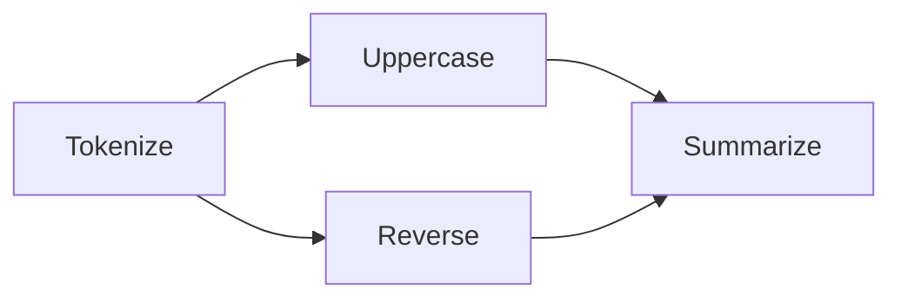

# Branching & Parallelism

A `Branch` runs multiple pipelines in parallel on the same input, then merges their outputs before the next step. It is itself a step — it satisfies `StepProtocol` and can be used anywhere a step is expected.

---

## What is a Branch?



The branch forks the context to both child pipelines, runs them in parallel, and joins (merges) the results before `Summarize` runs. The join is implicit — any step after a `Branch` waits for all branches to complete.

---

## Creating branches

Two equivalent APIs:

=== "Fluent shorthand"

    ```python
    pipe = (
        Pipeline()
        .then(Tokenize())
        .branch(
            Pipeline().then(Uppercase()),
            Pipeline().then(Reverse()),
            merge=MergeStrategy.RAISE_ON_CONFLICT,
        )
        .then(Summarize())
    )
    ```

=== "Explicit Branch"

    ```python
    from pipeline import Branch, MergeStrategy

    branch_step = Branch(
        Pipeline().then(Uppercase()),
        Pipeline().then(Reverse()),
        merge=MergeStrategy.RAISE_ON_CONFLICT,
    )

    pipe = (
        Pipeline()
        .then(Tokenize())
        .then(branch_step)
        .then(Summarize())
    )
    ```

---

## Merge strategies

When all branches complete, their output contexts must be merged back into one. The `merge` parameter controls how conflicts are resolved.

### `RAISE_ON_CONFLICT` (default)

Raises `ValueError` if two branches write different values to the same named field. Disjoint fields pass through without conflict.

```python
pipe = (
    Pipeline()
    .then(Tokenize())
    .branch(
        Pipeline().then(Uppercase()),    # provides: {"upper_tokens"}
        Pipeline().then(Reverse()),      # provides: {"reversed_tokens"}
        merge=MergeStrategy.RAISE_ON_CONFLICT,
    )
)

# Works — branches write to different fields
results = pipe.run([StepContext(sample="hello world")])
```

!!! tip
    In practice, branches that write disjoint fields (which is the common case) never conflict and the merge is a no-op.

### `LAST_WRITE_WINS`

The last branch's value wins for every conflicting field. Simple but lossy.

```python
pipe = Pipeline().then(Tokenize()).branch(
    Pipeline().then(Uppercase()),
    Pipeline().then(Reverse()),
    merge=MergeStrategy.LAST_WRITE_WINS,
)
```

### `NAMESPACED`

Each branch's output is stored at `metadata["branch_0"]`, `metadata["branch_1"]`, etc. No conflict is possible.

```python
pipe = Pipeline().then(Tokenize()).branch(
    Pipeline().then(Uppercase()),
    Pipeline().then(Reverse()),
    merge=MergeStrategy.NAMESPACED,
)

results = pipe.run([StepContext(sample="hello world")])
meta = results[0].output.metadata
print(meta["branch_0"])  # context from Uppercase branch
print(meta["branch_1"])  # context from Reverse branch
```

### Custom merge function

For full control, pass a callable:

```python
def priority_merge(ctxs: list[StepContext]) -> StepContext:
    """First branch wins for all fields."""
    base = ctxs[0]
    merged_meta = dict(base.metadata)
    for ctx in ctxs[1:]:
        for k, v in ctx.metadata.items():
            merged_meta.setdefault(k, v)  # first writer wins
    return base.replace(metadata=MappingProxyType(merged_meta))

pipe = Pipeline().then(Tokenize()).branch(
    Pipeline().then(Uppercase()),
    Pipeline().then(Reverse()),
    merge=priority_merge,
)
```

---

## How context flows through branches

1. All branches receive the **same frozen context** — no copy needed since `StepContext` is immutable
2. Each branch runs its pipeline and returns a **new** context
3. The merge function receives the list of output contexts and returns a single merged context
4. The merged context is passed to the next step in the outer pipeline

Immutability is what makes this safe. No branch can corrupt another branch's input.

---

## Execution model

=== "Sync"

    Branches run in a `ThreadPoolExecutor` with `max_workers=len(pipelines)`:

    ```python
    # All branches get their own thread
    with ThreadPoolExecutor(max_workers=len(self.pipelines)) as executor:
        futures = [executor.submit(p, ctx) for p in self.pipelines]
        results = [f.result() for f in futures]
    return self._merge_fn(results)
    ```

=== "Async"

    Branches run via `asyncio.gather`. Sync child pipelines are wrapped with `asyncio.to_thread`:

    ```python
    results = await asyncio.gather(
        *[run_child(p) for p in self.pipelines],
        return_exceptions=True,
    )
    return self._merge_fn(results)
    ```

In both cases, all branches run to completion even if one fails.

---

## Error handling in branches

When one or more branches fail, a `BranchError` is raised — but only after **all** branches have completed:

```python
from pipeline.errors import BranchError

try:
    results = pipe.run(contexts)
except BranchError as e:
    print(f"{len(e.failures)} branch(es) failed")
    for failure in e.failures:
        print(f"  - {type(failure).__name__}: {failure}")
```

- `BranchError.failures` contains one exception per failed branch
- Successful branches are not lost — their contexts are still available
- `SampleResult.failed_at` is set to `"Branch"` and `SampleResult.cause` carries the inner exception

See [Error Handling](error-handling.md) for the full error model.

---

## Contract inference

A `Branch` computes its own `requires` and `provides` from the union of its children:

```python
branch = Branch(
    Pipeline().then(Uppercase()),    # requires: {"tokens"}, provides: {"upper_tokens"}
    Pipeline().then(Reverse()),      # requires: {"tokens"}, provides: {"reversed_tokens"}
)

# Inferred:
# branch.requires = {"tokens"}
# branch.provides = {"upper_tokens", "reversed_tokens"}
```

The outer pipeline validates against these aggregated contracts at construction time, so nesting branches inside pipelines works seamlessly.
