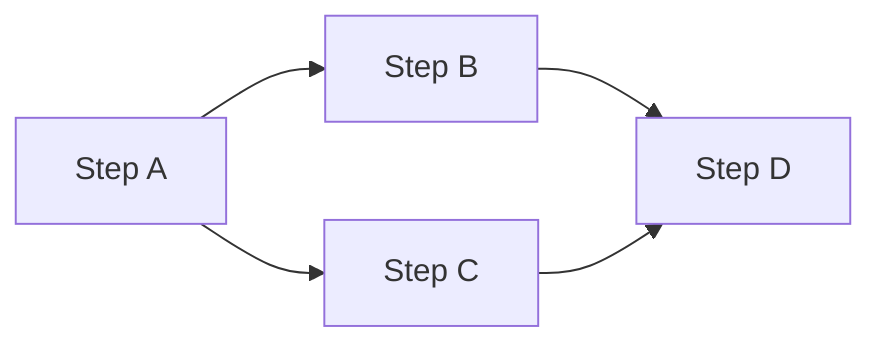
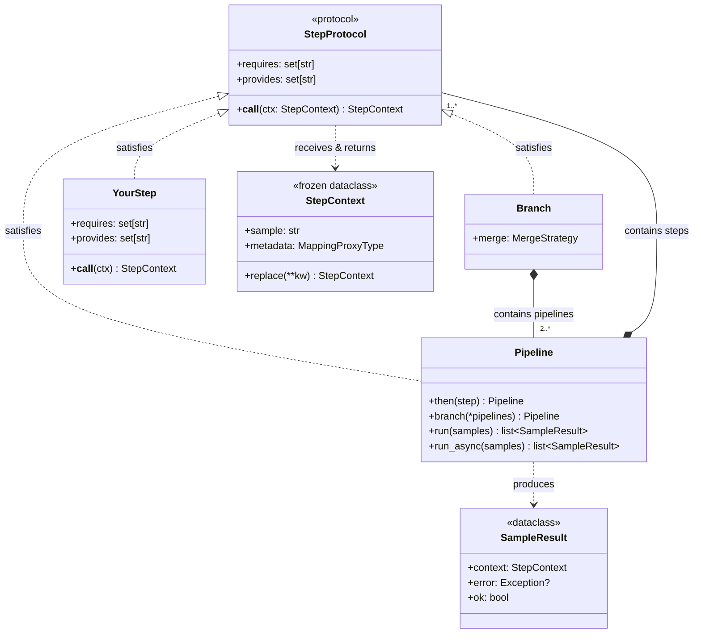

# Pipeline Engine

A generic, composable step runner for ordered and parallel data processing.

---

## What is the Pipeline Engine?

The Pipeline Engine is a lightweight, domain-agnostic framework for composing processing steps into pipelines. It provides contract validation, immutable context passing, and built-in concurrency control — all in ~300 lines of pure Python with no external dependencies beyond the standard library.

Everything composes from three primitives:

**Sequential** — steps run one after another:


**Branch** — fork, run in parallel, join:



**Nesting** — a pipeline used as a step:


Steps declare what data they read and write. The pipeline validates ordering at construction time — before any data flows — so wiring errors surface immediately, not at runtime.

---

## Core Principles

- **Three primitives** — Sequential steps, parallel branches, and nested pipelines cover every composition pattern
- **Contracts** — Steps declare `requires` and `provides` fields; the pipeline validates ordering at construction time
- **Immutable context** — Steps receive a frozen context and return a new one via `.replace()`, making concurrent execution safe by default
- **Declared concurrency** — Parallelism is configured on the step (`max_workers`, `async_boundary`), not the pipeline
- **Per-sample error isolation** — One failing sample never blocks others; every sample produces a result

---

## Architecture at a Glance



`Pipeline` and `Branch` both satisfy `StepProtocol` through structural typing — no inheritance required. This means a `Pipeline` can be used as a step inside another pipeline, and a `Branch` slots into any step position.

| Concept | What it is | Threading | Data flow |
|---------|-----------|-----------|-----------|
| **Step** | Single unit of work | Sync internally | Receives and returns `StepContext` |
| **Pipeline** | Ordered chain of steps | `workers=N` across samples | Passes `StepContext` step-to-step |
| **Branch** | Parallel fork/join | One thread per branch | Copies context in, merges outputs |
| **Nested Pipeline** | Pipeline used as a step | Inherits parent threading | Same `StepContext` flow |

---

## Async Boundary — Background Processing

One of the engine's key features is the **async boundary**: a way to split a pipeline into foreground (fast return) and background (fire-and-forget) stages.


Mark any step with `async_boundary = True` — the pipeline returns results immediately after the foreground steps, while everything from the boundary onward continues in background threads. Use `pipe.wait_for_background()` when you need the final results.

This is critical for pipelines where early steps produce user-facing output quickly but later steps (analysis, logging, scoring) are slow and don't need to block the caller. See [Execution Model](execution.md) for full details.

---

## When to Use

!!! tip "Good fit"
    - Ordered multi-step processing with explicit data dependencies
    - Parallel fork/join patterns (multiple independent operations on the same data)
    - Fire-and-forget background processing with `async_boundary`
    - Any pipeline where you want construction-time contract validation

!!! note "Not designed for"
    - DAG scheduling with complex dependency graphs
    - Distributed computing across multiple machines
    - Stream processing with backpressure
    - ETL pipelines requiring a data catalog

---

## Installation

The pipeline engine is included in the project with no extra dependencies:

```python
from pipeline import Pipeline, Branch, StepContext, MergeStrategy
```

---

## What's Next

- [**Quick Start**](quick-start.md) — Build and run your first pipeline in under 30 lines
- [**Core Concepts**](core-concepts.md) — Understand Step, Context, and the contract system
- [**Execution Model**](execution.md) — Three types of async, workers, and background processing
- [**Branching & Parallelism**](branching.md) — Parallel fork/join with merge strategies
- [**Error Handling**](error-handling.md) — Per-sample isolation, SampleResult, and error types
- [**Building Custom Steps**](custom-steps.md) — Create your own steps with dependency injection
- [**API Reference**](api-reference.md) — Complete signatures for all public classes
